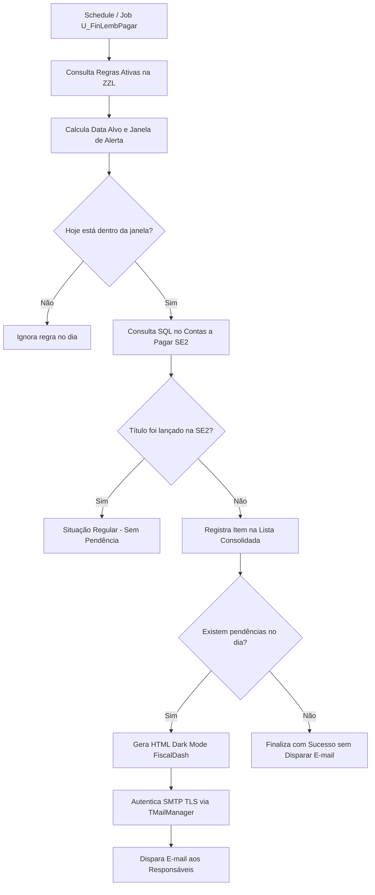

# 🔔 Automação de Lembretes Financeiros & Fiscais — TOTVS Protheus

<p align="center">
  
  
  
  
</p>

> **"Cão de Guarda Financeiro & Fiscal"**: Rotina autônoma de auditoria contínua para o Contas a Pagar (`SE2`), monitorando o lançamento e vencimento de despesas fixas, tributos e compromissos recorrentes, disparando relatórios executivos consolidados por e-mail.

---

## 📌 Sumário
- [Visão Geral](#-visão-geral)
- [Fluxo de Funcionamento](#-fluxo-de-funcionamento)
- [Fontes e Arquitetura do Projeto](#-fontes-e-arquitetura-do-projeto)
- [Regra de Negócio e Amarração SQL](#-regra-de-negócio-e-amarração-sql)
- [Dicionário de Dados (Tabela ZZL)](#-dicionário-de-dados-tabela-zzl)
- [Template de E-mail FiscalDash](#-template-de-e-mail-fiscaldash)
- [Configuração de Parâmetros Protheus (SX6)](#-configuração-de-parâmetros-protheus-sx6)
- [Como Instalar, Testar e Agendar](#-como-instalar-testar-e-agendar)

---

## 💡 Visão Geral

Nas empresas que utilizam o TOTVS Protheus, o atraso ou esquecimento no lançamento de despesas previsíveis (tais como DARF, FGTS, GPS, aluguéis, condomínios, folhas e contratos de manutenção) acarreta multas, juros fiscais e bloqueios contratuais.

Esta solução atua de ponta a ponta:
1. **Cadastro Parametrizável em MVC:** Gestores cadastram regras flexíveis de despesas (filial, tipo, fornecedor, vencimento, recorrência e dias de antecedência).
2. **Auditoria Diária Automatizada:** Job em **TLPP** cruza as regras contra os títulos efetivamente gerados na tabela de Contas a Pagar (`SE2`).
3. **Notificação Consolidada (Sem Spam):** Reúne todas as pendências de todas as filiais e empresas em um único e-mail com layout executivo moderno em Dark Mode (padrão *FiscalDash*).

---

## 🔄 Fluxo de Funcionamento



---

## 📂 Fontes e Arquitetura do Projeto

```
automacaoLembretes/
├── src/
│   ├── updlemb.prw         # Dicionário de dados da tabela ZZL (SX2, SX3, SIX)
│   ├── U_FinCfgLemb.prw    # Interface de usuário (CRUD) em arquitetura MVC
│   └── U_FinLembPagar.tlpp # Job de auditoria, cruzamento SQL e envio SMTP
├── .gitignore              # Filtros de compilação e caches do TDS/VS Code
└── README.md               # Documentação técnica do repositório
```

| Fonte | Linguagem | Finalidade |
| :--- | :---: | :--- |
| [`src/updlemb.prw`](src/updlemb.prw) | **AdvPL** | **Compatibilizador / Dicionário:** Criação da tabela customizada `ZZL` (Regras de Lembretes Financeiros), seus índices e campos no dicionário do Protheus. |
| [`src/U_FinCfgLemb.prw`](src/U_FinCfgLemb.prw) | **AdvPL** | **Interface MVC (`FWMBrowse` / `MPFormModel`):** Tela visual para inclusão, consulta, alteração e exclusão de regras de forma intuitiva. |
| [`src/U_FinLembPagar.tlpp`](src/U_FinLembPagar.tlpp) | **TLPP** | **Job de Auditoria & Notificação:** Motor de varredura das regras, verificação no Contas a Pagar (`SE2`) e geração do e-mail responsivo. |

---

## ⚙️ Regra de Negócio e Amarração SQL

A inteligência da auditoria baseia-se no cruzamento da tabela de regras (`ZZL`) com a tabela de títulos a pagar (`SE2`):

```
┌──────────────────────────────────────────────┐
│                  TABELA ZZL                  │
│  (Regras Cadastradas pelo Usuário)           │
│  • ZZL_FILIAL + ZZL_CODFL -> Filial (ex 0401)│
│  • ZZL_TIPO               -> Tipo (ex TX)    │
│  • ZZL_FORN               -> Fornecedor      │
│  • ZZL_NATURE             -> Natureza        │
│  • ZZL_VENC               -> Dia ou Data     │
│  • ZZL_RECOR              -> Recorrente?     │
│  • ZZL_AVISO              -> Dias de Aviso   │
└──────────────────────┬───────────────────────┘
                       │
                       ▼ ── [CRUZAMENTO SQL VIA TOPCONNECT]
┌──────────────────────────────────────────────┐
│                  TABELA SE2                  │
│  (Contas a Pagar - SIGAFIN)                  │
│  • E2_FILIAL   == ZZL_FILIAL + ZZL_CODFL     │
│  • E2_TIPO     == ZZL_TIPO                   │
│  • E2_FORNECE  == ZZL_FORN  (se preenchido)  │
│  • E2_NATUREZ  == ZZL_NATURE(se preenchido)  │
│  • D_E_L_E_T_  == ' '                        │
└──────────────────────────────────────────────┘
```

### Cálculo Inteligente de Datas (`dAlvo`)
* **Despesas Recorrentes (`ZZL_RECOR = .T.`):** O sistema projeta o vencimento para o mês atual e trata automaticamente meses com 28, 29 ou 30 dias via `LastDay()`, evitando erros de datas inválidas. Também calcula antecipadamente a virada de mês.
* **Despesas Pontuais (`ZZL_RECOR = .F.`):** Utiliza exatamente a data específica configurada.
* **Janela de Aviso:** Notifica se $\text{Data Atual} \ge (\text{dAlvo} - \text{Dias de Aviso})$ ou se já estiver vencida há até 30 dias.

---

## 🗄️ Dicionário de Dados (Tabela `ZZL`)

A tabela customizada `ZZL` é estruturada com os seguintes campos:

| Campo | Tipo | Tam | Dec | Título | Descrição / Finalidade |
| :--- | :---: | :---: | :---: | :--- | :--- |
| `ZZL_CODFL` | C | 2 | 0 | Cód. Empresa | Código da empresa no Protheus (ex: `01`) |
| `ZZL_FILIAL`| C | 2 | 0 | Cód. Filial | Código da filial no Protheus (ex: `01`) |
| `ZZL_DESC` | C | 40 | 0 | Descrição | Nome da obrigação (ex: `DARF PIS/COFINS`, `ALUGUEL`) |
| `ZZL_TIPO` | C | 3 | 0 | Tipo Título | Tipo de documento na `SE2` (ex: `TX`, `NF`, `BOL`, `DIR`) |
| `ZZL_NATURE`| C | 10 | 0 | Natureza | Natureza financeira na `SE2` *(Opcional)* |
| `ZZL_FORN` | C | 6 | 0 | Fornecedor | Código do fornecedor na `SE2` *(Opcional)* |
| `ZZL_VENC` | C | 8 | 0 | Vencimento | Data prevista (`DDMMYYYY`) ou dia base |
| `ZZL_RECOR` | L | 1 | 0 | Recorrente | `.T.` para recorrência mensal; `.F.` para pontual |
| `ZZL_AVISO` | N | 2 | 0 | Dias Aviso | Quantidade de dias de antecedência para os alertas |
| `ZZL_EMAIL` | C | 50 | 0 | E-mail Destino | E-mail do responsável que receberá a notificação |

---

## ✉️ Template de E-mail FiscalDash

O disparo compila as pendências em um relatório executivo responsivo (HTML/CSS inline):
* **Cards de Indicadores (KPIs):**
  * 🟣 **Total de Obrigações** auditadas
  * 🔴 **Atrasadas** (vencimento anterior a hoje)
  * 🟡 **A Vencer** (dentro da janela de alerta)
* **Tabela de Detalhamento:** Empresa, Descrição amigável, Tipo de documento, Fornecedor, Data de vencimento e Situação com Badges coloridos.
* **Envio Nativo:** Utiliza `TMailManager` e `TMailMessage` do próprio AppServer com suporte a **TLS/SSL (portas 587/465)**, sem depender de scripts externos.

---

## ⚙️ Configuração de Parâmetros Protheus (SX6)

Certifique-se de que os seguintes parâmetros de e-mail estejam configurados no Configurador (`SIGACFG`):

| Parâmetro | Tipo | Exemplo / Descrição |
| :--- | :---: | :--- |
| `MV_RELSERV` | Caractere | Servidor SMTP e porta (ex: `smtp.office365.com:587` ou `smtp.gmail.com:587`) |
| `MV_RELACNT` | Caractere | Conta de e-mail autenticada para o envio |
| `MV_RELPSW` | Caractere | Senha da conta ou Senha de Aplicativo (App Password) |
| `MV_RELPORT` | Caractere | Porta SMTP (padrão: `587`) |

---

## 🚀 Como Instalar, Testar e Agendar

### 1. Compilação
Adicione os fontes da pasta `src/` ao seu repositório de fontes e compile no ambiente Protheus (RPO).

### 2. Inicialização do Dicionário (`ZZL`)
Execute via Protheus SmartClient a função compatibilizadora:
* **Programa Inicial:** `U_UPDZZL`

### 3. Cadastro das Regras
Acesse a tela de manutenção das regras executando:
* **Programa Inicial:** `U_FinCfgLemb`
* Cadastre os compromissos informando filial, tipo de título, dia base e e-mail de destino.

### 4. Agendamento Automático no Schedule
Para que a auditoria seja executada diariamente de forma autônoma:
1. Acesse o módulo **Configurador (`SIGACFG`)** $\rightarrow$ **Ambiente** $\rightarrow$ **Schedule** $\rightarrow$ **Schedule**.
2. Adicione uma nova tarefa com a rotina:
   * **Rotina:** `U_FinLembPagar`
   * **Recorrência:** Diária (recomendado entre 07:00 e 08:00 da manhã).

---

## 👨‍💻 Autor

Desenvolvido por **Salin Gean**  
E-mail: [salingeanestrela@gmail.com](mailto:salingeanestrela@gmail.com)  
LinkedIn: [linkedin.com/in/salingeanestrela](https://www.linkedin.com/in/salingeanestrela)
